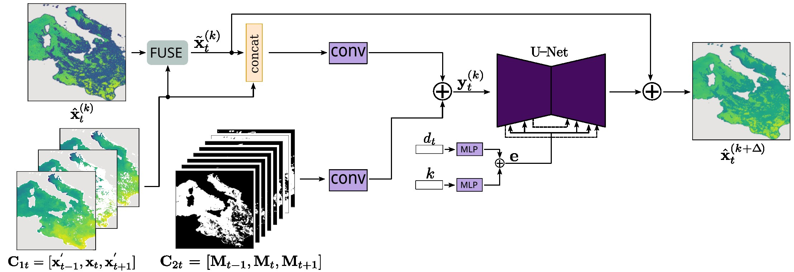

# DIRECT 1.0: A diffusion-based generative model for dense sea surface temperature reconstructions from sparse satellite observations

This repository contains the official PyTorch implementation of the paper ["DIRECT 1.0: A diffusion-based generative model for dense sea surface temperature reconstructions from sparse satellite observations"]

## Abstract
Sea surface temperature (SST) reconstruction of missing values in cloud-covered regions is crucial for many downstream numerical modeling tasks and other applications. The problem is fundamentally ambiguous, yet most state-of-the-art methods remain deterministic, producing a single overly-smoothed reconstruction, often contaminated by artifacts, or offering a limited uncertainty estimation. We present DIRECT, a conditional generative model that reconstructs dense SST fields by learning the full conditional distribution of plausible solutions. DIRECT proposes a rectified flow-matching formulation, with the network conditioned on temporal context and day-of-year seasonality, and presents an observation-guided rectification that anchors the generative trajectory to measured pixels at every integration step. DIRECT produces an ensemble of physically consistent reconstructions, yielding both an accurate mean estimate and spatially resolved uncertainty that is well-calibrated via a lightweight post-hoc variance correction. DIRECT sets a new state-of-the-art on three Level-3 SST datasets (Mediterranean, Adriatic, Atlantic), reducing Root Mean Square Error (RMSE, in $\text{°C}$) by 6-14\% compared to the strongest published method and better preserving the mesoscale structure. Analysis of spatial scale correlations in the reconstructed fields indicate that DIRECT delivers physically consistent spatial textures when reconstructing large and completely unobserved areas. Lower reconstruction errors are robust to cloud coverage - compared to current state of the art, DIRECT consistently delivers best performance from low to high cloud cover conditions, making it suitable for reliable reconstructions over most parts of the global ocean.



## Environment
```bash
conda create -n direct_env python=3.12
pip install -r requirements.txt
```

## Pretrained Models

Pretrained checkpoints for the DIRECT model, trained on Mediterranean, Adriatic, and Atlantic datasets, are available at the provided links below:

| Dataset        | Pretrained Checkpoint |
|----------------|-----------------------|
| Mediterranean  | [download](https://drive.google.com/drive/folders/1YInFrEMwejbzKfqOnXl36xA9xpME5C3G?usp=sharing) |
| Adriatic       | [download](https://drive.google.com/drive/folders/1meCJ8gsW0ZoQtSQB5YyA0BVwOrZMdM8V?usp=sharing) |
| Atlantic       | [download](https://drive.google.com/drive/folders/18Ncpn66CaMj1V1cC0vc-ov44A41wdsNM?usp=sharing) |

## Datasets

The Mediterranean, Adriatic, and Atlantic datasets used for training and testing the DIRECT model are available at:

| Dataset        | Download Link |
|----------------|---------------|
| Mediterranean  | [download](https://drive.google.com/file/d/1DQxTrDcEY01t9v-5VD3ZmqL5kuFiO5Ju/view?usp=sharing) |
| Adriatic       | [download](https://drive.google.com/file/d/19KryQygIvLQznI6OBsXABi0S1pz984Ao/view?usp=sharing) |
| Atlantic       | [download](https://drive.google.com/file/d/1lHL0JeBNfCxev0V94Y3M1iDmYnwCgh-9/view?usp=sharing) |


## Evaluate 

Evaluate using the checkpoints:

```bash
python eval.py --test_config="./configs/test_direct.yaml"
```

Slurm script `run_slurm_test_direct.sh` is also provided to execute evaluation on a slurm based system.

Config file for evaluating the model is ./configs/test_direct.yaml  

---

## Train

Train the model:

```bash
python train.py --config="./configs/train_direct.yaml"
```

Slurm script `run_slurm_train_direct.sh` is also provided to execute training on a slurm based system.

Config file for training the model and datasets selection is ./configs/train_direct.yaml  

---